# FarmVidhya.ai - Backend System Architecture

**Version:** 2.1.0 (Staged & Validated)
**Date:** September 24, 2025

This document serves as the single source of truth for the FarmVidhya.ai backend system. It details the service-oriented architecture, technology stack, local setup guide, and the complete, validated end-to-end workflow for processing conversational AI jobs.

## 1. High-Level Description

The FarmVidhya.ai backend is a cloud-native, distributed platform designed to handle complex, multi-step, asynchronous conversational AI workflows. Architected for resilience and scalability, its primary function is to accept user-uploaded audio files, orchestrate their processing through a chain of external Machine Learning APIs (STT, NMT, RAG, TTS), and deliver a final audio result.

The system is built on a service-oriented model, separating concerns like identity, billing, and job processing into distinct, independently scalable microservices. Communication is handled via REST APIs for synchronous operations and a Kafka message broker for asynchronous tasks, ensuring a responsive user experience even for long-running jobs.

---

## 2. System Architecture & Data Flow

The architecture consists of **6 core backend services** that interact with cloud infrastructure and external APIs to fulfill a user request.

### 2.1. Architectural Flowchart

This diagram illustrates the primary "happy path" for submitting and processing a new conversational AI job.

```mermaid
graph TD
    subgraph Client [Client-Side]
        User["End User (Postman/Frontend)"]
    end

    subgraph Cloud_Infrastructure [Cloud Infrastructure]
        AzureBlob["Azure Blob Storage (uploads/results)"]
        AzureQueue["Azure Storage Queue (upload-notifications)"]
        Kafka["Apache Kafka (jobs_topic)"]
        Postgres["Central PostgreSQL DB"]
    end

    subgraph Backend_Platform [Backend Platform - 6 Core Services]
        A[api_gateway]
        B[identity_service]
        C[queue_service]
        D[billing_service]
        E[orchestration_service]
        F[worker_service]
    end

    subgraph External_ML_APIs [External ML APIs]
        STT["STT API (v1)"]
        NMT["NMT API (v2)"]
        RAG["RAG API (v3)"]
        TTS["TTS API (v4)"]
    end

    %% Synchronous Staging Flow
    User -- "1. POST /jobs/initiate-upload (API Key)" --> A
    A -- "2. Validate Key" --> B
    A -- "3. Forward Request" --> C
    C -- "4. Check Credits" --> D
    C -- "5. Create Job (status: AWAITING_UPLOAD)" --> Postgres
    C -- "6. Generate Secure Upload URL" --> A
    A -- "7. Return URL to User" --> User
    User -- "8. PUT file directly to Azure" --> AzureBlob

    %% Asynchronous Processing Flow
    AzureBlob -- "9. Event: BlobCreated" --> AzureQueue
    F -- "10. Consume Event" --> AzureQueue
    F -- "11. Update Job (status: PENDING)" --> Postgres
    F -- "12. Publish Job" --> Kafka
    E -- "13. Consume Job" --> Kafka
    E -- "14. Download File" --> AzureBlob
    E -- "15. Call STT (Audio -> Telugu Text)" --> STT
    E -- "16. Call NMT (Telugu -> English Text)" --> NMT
    E -- "17. Call RAG (English Text -> English Answer)" --> RAG
    E -- "18. Call NMT (English -> Telugu Answer)" --> NMT
    E -- "19. Call TTS (Telugu Answer -> Telugu Audio)" --> TTS
    E -- "20. Upload Result" --> AzureBlob
    E -- "21. Deduct Credits" --> D
    E -- "22. Update Job (status: COMPLETED)" --> Postgres
```



### 2.2. Services Overview

| Service Name              | Core Responsibility                                                                          | Technologies                 |
| ------------------------- | -------------------------------------------------------------------------------------------- | ---------------------------- |
| **`api_gateway`**         | Single, secure entry point. Handles routing, rate limiting, and initial authentication.        | FastAPI, Uvicorn, SlowAPI    |
| **`identity_service`**    | Manages user accounts, authentication (OTP/password), and API key lifecycle.                 | FastAPI, SQLAlchemy (async)  |
| **`billing_service`**     | Isolated service for credit balances and pricing policies.                                   | FastAPI, SQLAlchemy (async)  |
| **`queue_service`**       | Transactional entry point for jobs. Validates, checks credits, and provisions secure Azure upload URLs. | FastAPI, SQLAlchemy (async)  |
| **`worker_service`**      | A background worker that runs concurrent tasks: consuming Azure Queue events, and handling DLQ alerts. | AIOKafka, Azure SDK (Queue)  |
| **`orchestration_service`** | The "brains" of the system. An asynchronous worker that consumes jobs from Kafka and executes the multi-step AI workflow. | AIOKafka, HTTPX, Azure SDK (Blob) |

---

## 3. Technology Stack

*   **Language:** Python 3.11+
*   **API Framework:** FastAPI
*   **Database:** PostgreSQL (with `asyncpg` driver)
*   **Message Broker:** Apache Kafka
*   **Cloud Storage:** Microsoft Azure (Blob Storage, Queue Storage)
*   **Key Python Libraries:**
    *   `fastapi`, `uvicorn`: Core web server and framework.
    *   `SQLAlchemy`: Asynchronous ORM for database interaction.
    *   `httpx`: Asynchronous HTTP client for service-to-service communication.
    *   `aiokafka`: High-performance asynchronous Kafka client.
    *   `azure-storage-blob`, `azure-storage-queue`: Official Azure SDKs.
    *   `passlib[argon2]`: For secure password and API key hashing.
    *   `structlog`: For structured, production-grade logging.
    *   `python-dotenv`: For managing environment variables.

---

## 4. Local Development Setup

This guide assumes a WSL (Ubuntu) environment.

### 4.1. Install System Dependencies

```bash
# Update package lists
sudo apt update && sudo apt upgrade -y

# Install Python and related tools
sudo apt install python3.11 python3.11-venv python3-pip -y

# Install PostgreSQL
sudo apt install postgresql postgresql-contrib -y

# Install Java (required for Kafka)
sudo apt install default-jdk -y
```

### 4.2. Set Up PostgreSQL

```bash
# Start the PostgreSQL service
sudo service postgresql start

# Switch to the postgres user and open psql
sudo -u postgres psql

# In the psql prompt, run the following commands:
CREATE ROLE farmvidhya WITH LOGIN PASSWORD 'password' CREATEDB;
CREATE DATABASE farmvidhya_prod_db OWNER farmvidhya;
\q
```

### 4.3. Set Up Apache Kafka

Follow the official Apache Kafka quickstart guide to download, extract, and configure Kafka using KRaft mode. Ensure your `server.properties` file is configured correctly.

### 4.4. Set Up the Python Project

```bash
# Navigate to your project directory (e.g., ~/Backend)
cd ~/Backend

# Create and activate a Python virtual environment
python3.11 -m venv venv
source venv/bin/activate

# Install all project dependencies from the requirements file
pip install -r requirements.txt
```

### 4.5. Configure Environment Variables

1.  Ensure the master `.env` file exists in the root of the `~/Backend` directory.
2.  Populate it with all necessary values, especially:
    *   `CENTRAL_DATABASE_URL`
    *   `KAFKA_BOOTSTRAP_SERVERS`
    *   `AZURE_STORAGE_CONNECTION_STRING`
    *   All external ML API URLs (`STT_API_URL`, `NMT_API_URL`, etc.)

---

## 5. Running the System

Each component must be run in its own dedicated WSL terminal.

### 5.1. Start Infrastructure

*   **Terminal 1 (PostgreSQL):** `sudo service postgresql start`
*   **Terminal 2 (Kafka):**
    ```bash
    # Navigate to your Kafka directory
    cd ~/kafka
    # Start the Kafka server
    bin/kafka-server-start.sh config/kraft/server.properties
    ```

### 5.2. Start Backend Services

For each of the 6 services, open a new terminal, navigate to `~/Backend`, and activate the virtual environment (`source venv/bin/activate`). Then run the specific command:

| Service                   | Command                                                  |
| ------------------------- | -------------------------------------------------------- |
| **Billing Service**       | `python -m uvicorn billing_service.main:app --port 8004`   |
| **Identity Service**      | `python -m uvicorn identity_service.main:app --port 8001`  |
| **Queue Service**         | `python -m uvicorn queue_service.main:app --port 8003`     |
| **Worker Service**        | `python -m worker_service.worker`                        |
| **Orchestration Service** | `python -m orchestration_service.worker`                 |
| **API Gateway**           | `python -m uvicorn api_gateway.main:app --port 8000`     |

---

## 6. End-to-End Testing Guide

With all services running, use an API client like Postman and a `curl`-enabled terminal to execute the full user journey.

1.  **Onboard a User & Get API Key:** Follow the steps in `Definitive_Run_Sheet.txt` to sign up, verify with OTP, get the `user_id` from `psql`, and generate a secret API key.

2.  **Initiate Upload:**
    *   Send a `POST` request to `http://localhost:8000/jobs/initiate-upload`.
    *   Include the `Authorization: Bearer <YOUR_API_KEY>` header.
    *   Use the body: `{"filename": "test_audio.wav", "workflow_type": "conversational-agent-telugu"}`.
    *   **Copy the `upload_url`** from the response.

3.  **Upload the File (via curl):**
    *   Use the following command in your WSL terminal, replacing the placeholder with the URL you just copied. This is the most reliable method for uploading.
    ```bash
    curl -X PUT \
      -H "x-ms-blob-type: BlockBlob" \
      -H "Content-Type: audio/wav" \
      --data-binary "@test_audio.wav" \
      "PASTE_YOUR_NEW_UPLOAD_URL_HERE"
    ```

4.  **Observe & Verify:**
    *   Watch the `worker_service` and `orchestration_service` terminals to see the full, asynchronous chain reaction.
    *   The final log in the `orchestration_service` should be `✅ Job/Workflow completed successfully.`
    *   Verify the final status in the database using `psql`:
      ```sql
      SELECT status, result_data, error_message FROM jobs ORDER BY created_at DESC LIMIT 1;
      ```
    *   The `status` should be `COMPLETED` and the `result_data` will contain the URL of the final output audio file.